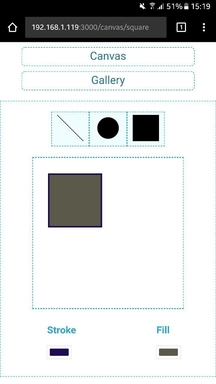
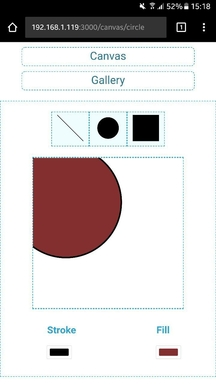
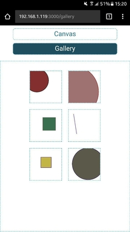

# Project Title

React SVG elements maker

## Screenshots

## Canvas Screen No.1


## Canvas Screen No.2


## Gallery Screen



## Getting Started

Follow these steps to get you started after cloning the repo:

```
npm install
```

and then start the app on localhost

```
npm start
```


The project will start and you also have an option to connect other devices to it using external prefrences

### Prerequisites

... will be installed with 

```
npm install
```


